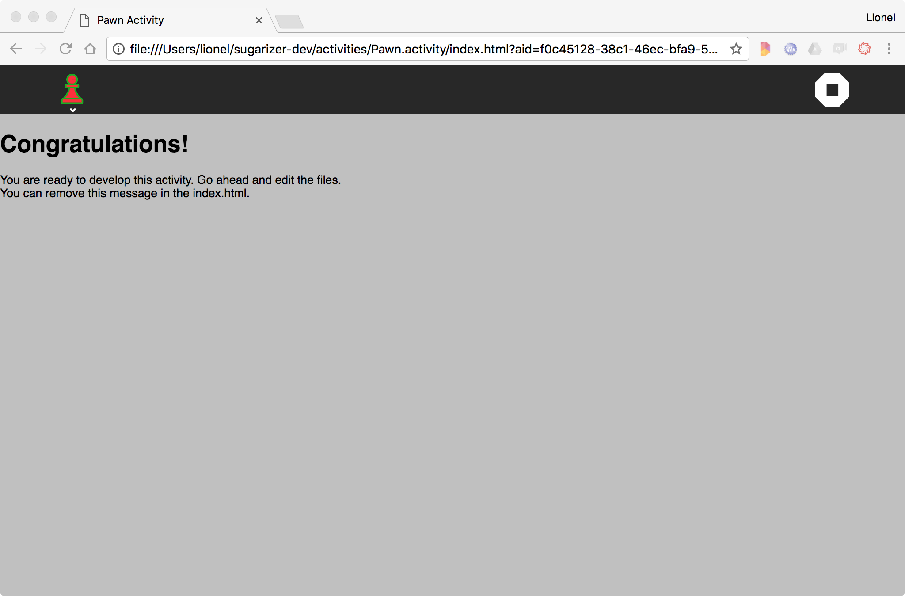
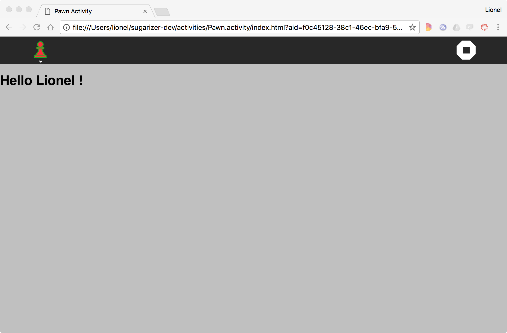

[Go back to tutorial home](tutorial.md)

# Step 2: Customize icon and contents
*(Estimated time: 30mn)*

Let's now improve our activity to customize the content.

## Customize the icon

The first task is to customize the icon. It's important because it's the visual identity of your activity.

For our new activity, we'll take a Pawn icon inspired by Andrejs Kirma from The Noun Project. You could download this file [here](../../images/pawn-icon.svg). Right-click on it and then save it in a `pawn-icon.svg` file into a new `Pawn.activity/icons` directory.


In Sugarizer, images for icons or buttons must be SVG graphic files. It needs to be adapted to support users' colors because as you could see on the home page, all icons in Sugarizer are dynamically adapted to users' colors.

To do that, we need to update our original SVG file.
Here's an extract on our original `icons/pawn-icon.svg` file:
```xml
<?xml version="1.0" encoding="UTF-8" standalone="no"?>
<svg
	xmlns:dc="http://purl.org/dc/elements/1.1/"
	xmlns:cc="http://creativecommons.org/ns#"
	xmlns:rdf="http://www.w3.org/1999/02/22-rdf-syntax-ns#"
	xmlns:svg="http://www.w3.org/2000/svg"
	xmlns="http://www.w3.org/2000/svg"
	xmlns:sodipodi="http://sodipodi.sourceforge.net/DTD/ sodipodi-0.dtd"
	xmlns:inkscape="http://www.inkscape.org/namespaces/inkscape"
	width="55pt"
	height="55pt"
	version="1.1"
	viewBox="0 0 55 55"
	id="svg2"
	inkscape:version="0.91 r13725"
	sodipodi:docname="pawn-icon.svg">
		...
	<g
		id="g4"
		style="fill:#808080;fill-rule:evenodd" transform="matrix(0.39971901,0,0,0.39971901,6.4164118,6.3421946)">
		<path
			style="fill:#808080"
			d="M 69.117,19.117 C 69.419097,8.5405271 59.563829,-0.82065091 49.016209,0.02487387 38.442487,0.26964532 29.602814,10.583179 30.981695,21.071762 31.767586,31.615772 42.507095,39.916726 52.911417,38.013738 62.017401,36.775538 69.289121,28.312864 69.117,19.117 Z m -32.352,0 C 36.487927,11.039319 44.80784,4.2563204 52.665901,6.151898 60.600506,7.5124622 65.573683,16.956696 62.192903,24.268128 59.309957,31.766263 49.109454,34.806773 42.600068,30.090646 38.995267,27.691276 36.726564,23.451719 36.765,19.117 Z"
			id="path6"
			inkscape:connector-curvature="0" />
		...
		</g>
	<g
		id="g4230"
		style="fill:#f0f0f0;stroke:#f0f0f0"
		transform="matrix(0.39971901,0,0,0.39971901,6.9463181,6.2146783)">
		...
	</g>
</svg>
```
To adapt this SVG file to Sugarizer, we will update the start of the file to add ENTITY variables named **stroke_color** and **fill_color**.

Then we will replace raw colors value `#xxxxxx` in the SVG file, by reference to `&fill_color;` and `&stroke_color;`.

Here, using your text editor you must replace all `#808080` by `&fill_color;` and all `#f0f0f0` by `&stroke_color;`.

Here is an extract of the result:
```xml
<?xml version="1.0" encoding="UTF-8" standalone="no"?>
<!DOCTYPE svg  PUBLIC '-//W3C//DTD SVG 1.1//EN'  'http://www.w3.org/Graphics/SVG/1.1/DTD/svg11.dtd' [
	<!ENTITY stroke_color "#010101">
	<!ENTITY fill_color "#FFFFFF">
]>
<svg
	xmlns:dc="http://purl.org/dc/elements/1.1/"
	xmlns:cc="http://creativecommons.org/ns#"
	xmlns:rdf="http://www.w3.org/1999/02/22-rdf-syntax-ns#"
	xmlns:svg="http://www.w3.org/2000/svg"
	xmlns="http://www.w3.org/2000/svg"
	xmlns:sodipodi="http://sodipodi.sourceforge.net/DTD/ sodipodi-0.dtd"
	xmlns:inkscape="http://www.inkscape.org/namespaces/inkscape"
	width="55pt"
	height="55pt"
	version="1.1"
	viewBox="0 0 55 55"
	id="svg2"
	inkscape:version="0.91 r13725"
	sodipodi:docname="pawn-icon.svg">
	...
	<g
		id="g4"
		style="fill:&fill_color;;fill-rule:evenodd" transform="matrix(0.39971901,0,0,0.39971901,6.4164118,6.3421946)">
		<path
			style="fill:&fill_color;"
			d="M 69.117,19.117 C 69.419097,8.5405271 59.563829,-0.82065091 49.016209,0.02487387 38.442487,0.26964532 29.602814,10.583179 30.981695,21.071762 31.767586,31.615772 42.507095,39.916726 52.911417,38.013738 62.017401,36.775538 69.289121,28.312864 69.117,19.117 Z m -32.352,0 C 36.487927,11.039319 44.80784,4.2563204 52.665901,6.151898 60.600506,7.5124622 65.573683,16.956696 62.192903,24.268128 59.309957,31.766263 49.109454,34.806773 42.600068,30.090646 38.995267,27.691276 36.726564,23.451719 36.765,19.117 Z"
			id="path6"
			inkscape:connector-curvature="0" />
		...
		</g>
	<g
		id="g4230"
		style="fill:&stroke_color;;stroke:&stroke_color;"
		transform="matrix(0.39971901,0,0,0.39971901,6.9463181,6.2146783)">
		...
	</g>
</svg>
```
To update the activity icon, replace also the content of `activity/activity-icon.svg` by the content of the `pawn-icon.svg` file.

Let's run again our activity. Now, we have a beautiful pawn icon.




Note that a Sugar icon set is available in `lib/sugar-web/graphics/icons/`. You could also find more information about how to create icons for Sugar [here](https://wiki.sugarlabs.org/go/Development_Team/Almanac/Making_Icons).


## Customize content

We will now change the content of our Window. More precisely, we're going to replace the **Congratulations** message by a welcome message to the user connected.

Let's first remove the default message, you could find it in `index.html` file:
```html
<h1>Congratulations!</h1>
<p>You are ready to develop this activity. Go ahead and edit the files.<br />
You can remove this message in the index.html.</p>
```
Replace these few lines by the following:
```html
<div id="user">
	<h1>{{ displayText }}</h1>
</div>
```
We'll have a `div` and heading inside it to show the welcome message dynamically using a reactive Vue.js data property `displayText`.

Now, let's study the file `js/activity.js`. It's really the heart of your new activity. The current implementation is:
```js
// Rebase require directory
requirejs.config({
	baseUrl: "lib",
	paths: {
		activity: "../js"
	}
});

// Vue main app
const app = Vue.createApp({
	// Register components as "html-tag-name": ComponentObjectName
	components: {
		"sugar-activity": SugarActivity,
		"sugar-toolbar": SugarToolbar,
		"sugar-toolitem": SugarToolitem,
	},

	data: function () {
		return {};
	},
	methods: {},
});

app.mount("#app");
```
These lines rely on the framework **require.js** that is used by Sugar-Web to handle JavaScript libraries dependencies. You could read more about the **require.js** framework [here](http://www.requirejs.org/). The first block of code is used to configure `requirejs` baseUrl to be the `lib` directory to load our dependencies and also to add a path to `js` directory. This is followed by a new Vue.js app instance mounted on `#app` element, specifying that it's being controlled by Vue.js. Make sure to add all your components/properties inside this element and Also don't forget to register/import(as script tag) all the components that is being used by app.

Now, to display our welcome message, we will use the user's name.

Inside `js/activity.js`, first add a data property `displayText` to the returned object .
```js
data: function () {
	return {
		displayText: ""
	};
},
```

To get the user's name we're going to use another Sugar-Web library named **env**. This library contains a very interesting method `getEnvironment`. This method allows you to retrieve all users settings: name, preferred colours, language, favorites, etc.
You can call this method directly from the `SugarActivity` component. 

Before using any resources of the activity, we must wait for the `initialized` event from the `SugarActivity` component.

So let's first add a click listener method to the directive of `SugarActivity` inside `index.html`:
```html
<sugar-activity ref="SugarActivity" @initialized="initialized"></sugar-activity>
```

And define the method to retrieve the user name and update `displayText` in `js/activity.js`:
```js
...
methods: {
	initialized: function () {
		// Sugarizer initialized
		const environment = this.$refs.SugarActivity.getEnvironment();
		this.displayText = "Hello " + environment.user.name + "!";	
	}
}
...
```
Being a Vue.js reactive property, `displayText` will automatically be rendered to the screen on update. That's all. Run the activity again.

Congratulations! The welcome message will now appear:




[Go to next step](step3.md)
